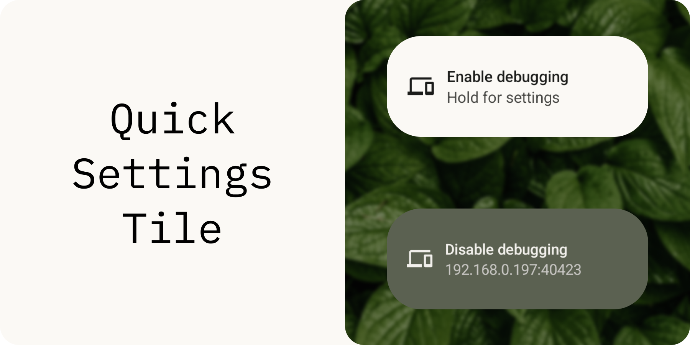
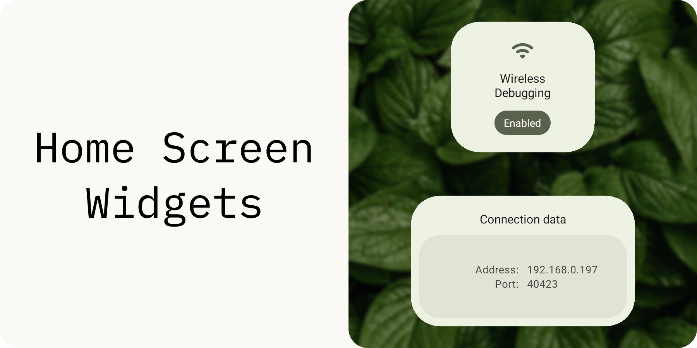
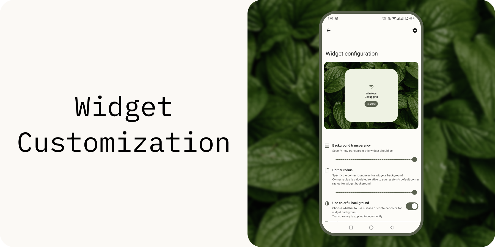
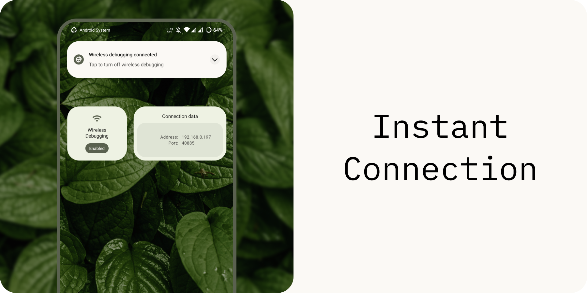

**Wireless Debugging Switch Widget** (or **WADBS** for short) is an app that allows you to switch Android's Wireless Debugging feature on and off quickly.
It provides several widgets and a quick settings tile to do this. You can also instantly connect to your PC using KDE Connect's clipboard sharing feature.

## Features

## Credits

[libsu](https://github.com/topjohnwu/libsu) - a library that makes performing root-requiring operations easier.
 [IBM Plex Mono](https://fonts.google.com/specimen/IBM+Plex+Mono) - this font was used in my designs for this README.
 [Wallpaper](https://lineageos.org/) - default wallpaper for a widget configuration activity is taken from Lineage OS.
 [Leaves](https://github.com/Smooth-E/wireless-adb-switch/issues/new) - an amazing image of leaves I used as a background for my designs was found somewhere in Telegram. If you are the holder of this image and want it to be removed from this page, create an issue in this repository stating why you think the image should be removed and proving that this image is indeed your intellectual property.

## License

WADBS is a free software. It was made with the intention to make developers' lives easier.
It is licensed under GNU General Public License version 3. 
In short - you can redistribute and modify it, but should give a credit to the original author in some way.

The above does not apply to the contents of the [media folder](./media/): because of a licensing controversy (see [Credits](#credits)) files located in [media](./media/) cannot be redistributed.

WADBS is distributed "as is". 
Developers of this app are not responsible for any kind of damage or harm made by the content of this repository or materials related to it directly or not.
