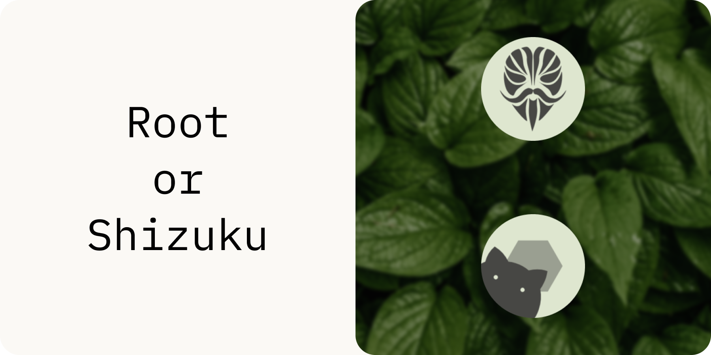
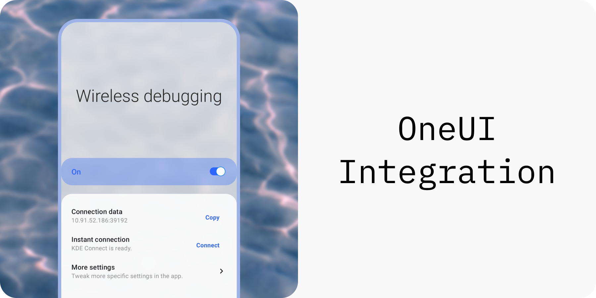

    
    

> Read in other languages: [`🇷🇺`](./readme.ru.md) [`🇧🇷`](./readme.pt_br.md) [`🇨🇳`](./readme.zh_cn.md) [`Translate into your language!`](./translate.md)

**WADBS** (short or **Wireless Android Debugging Bridge Switch**) is an app that allows you to switch Android's Wireless Debugging feature on and off quickly.
It provides several widgets and a quick settings tile to do this. 
You can also instantly connect to your PC using KDE Connect's clipboard sharing feature (see [scripts](./scripts)).

## Features

## Credits

[libsu](https://github.com/topjohnwu/libsu) - a library that makes performing root-requiring operations easier.
 [Shizuku](https://shizuku.rikka.app/) - a framework WADBS can use as an alternative to root access.
 [IBM Plex Mono](https://fonts.google.com/specimen/IBM+Plex+Mono) - font used in my designs for this app.
 [Leaves](https://unsplash.com/photos/wAU3MfsGPNw) - an amazing photo of leaves I used as a background for my designs was made by [Aedrian](https://unsplash.com/@aedrian).
 [Waves](https://unsplash.com/photos/a-close-up-of-a-body-of-water-with-ripples-dujWQFlKE7c) - an amazing photo of waves I used for the promo picture for OneUI integration was made by [Michał Bińkiewicz](https://unsplash.com/@binkievitz).

## License

WADBS is a free software. It was made with the intention to make developers' lives easier.
It is licensed under GNU General Public License version 3. 
In short - you can redistribute and modify it, but should give a credit to the original author.

WADBS is distributed "as is". 
Developers of this app are not responsible for any kind of damage or harm made by the content of this repository or materials related to it directly or not.
