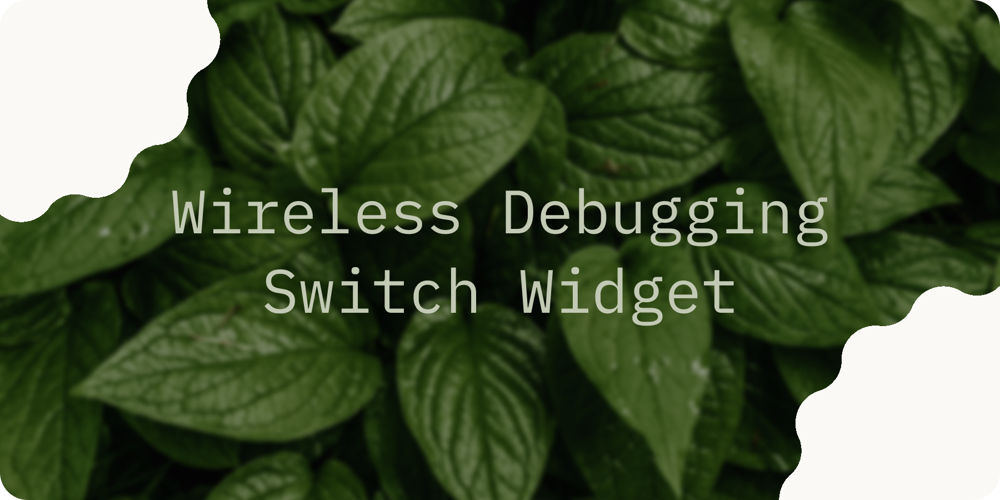
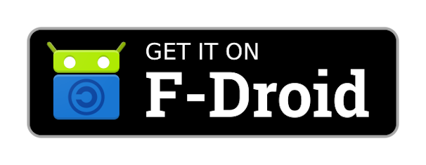
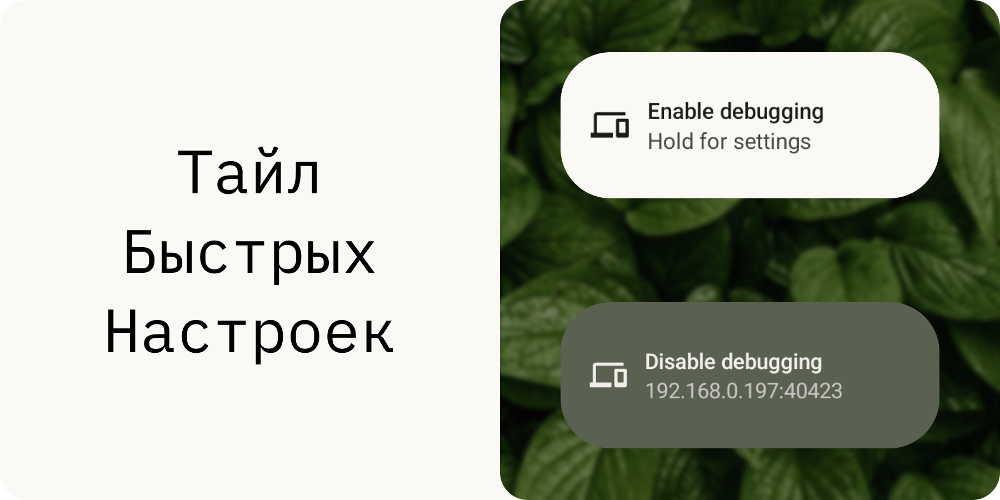
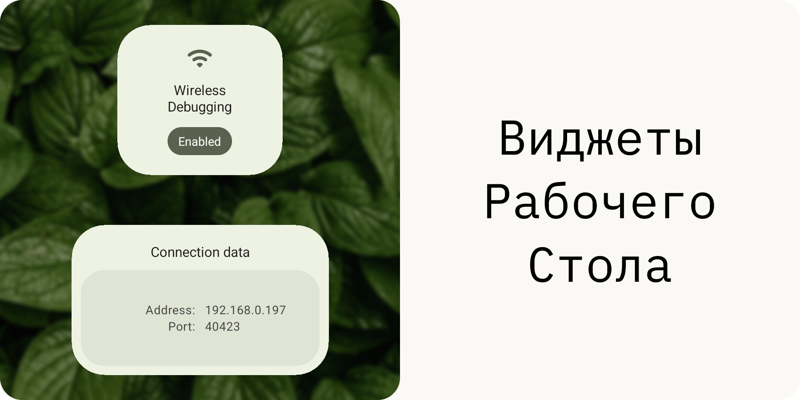
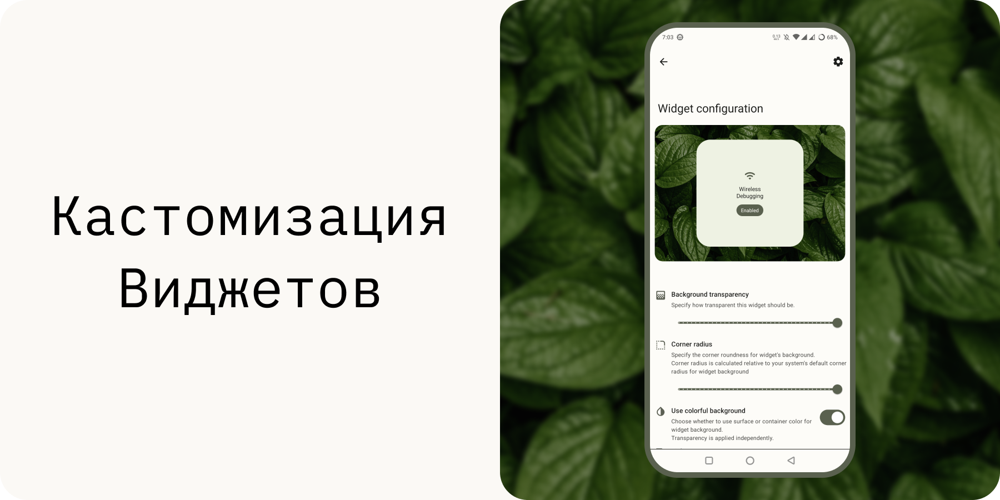
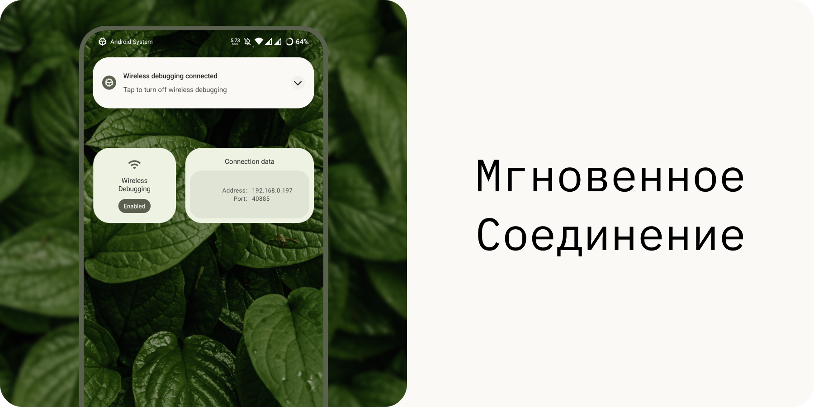
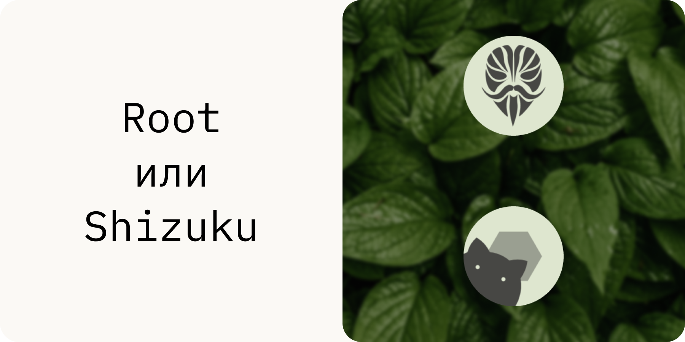
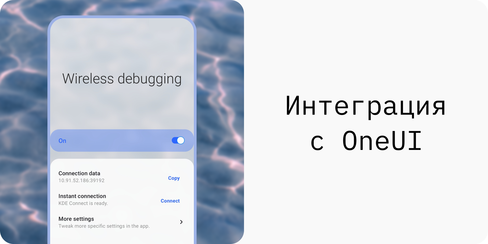

    
    

> Читайте на других языках: [`🇺🇸`](./readme.md) [`zh-CN`](./readme.zh-CN.md) [`Переведите на свой язык!`](./translate.md)

**Wireless Android Debugging Bridge Switch** (или **WADBS** в более краткой форме) - приложение, позволяющее легко включать и выключать функцию Беспроводной отладки на Android.
Для этого приложение предоставляет набор виджетов для рабочего стола, а также тайл быстрых настроек.
Вы также можете настроить мгновенное соединение с вашим ПК при помощи функции синхронизации буфером обмена в KDE Connect (подробнее [здесь](./scripts/readme.ru.md)).

## Функции и возможности

## Благодарности

[libsu](https://github.com/topjohnwu/libsu) - библиотека, позволяющая легко выполнять операции, требующие root-доступ.
 [Shizuku](https://shizuku.rikka.app/) - фреймворк, который WADBS может использовать в качестве альтернативы root-доступу.
 [IBM Plex Mono](https://fonts.google.com/specimen/IBM+Plex+Mono) - шрифт, использованный в дизайнах для этого приложения.
 [Листва](https://unsplash.com/photos/wAU3MfsGPNw) - автор замечательного фото листвы, которое я использовал в своих дизайнах, - [Aedrian](https://unsplash.com/@aedrian).
 [Волны](https://unsplash.com/photos/a-close-up-of-a-body-of-water-with-ripples-dujWQFlKE7c) - атор замечательного фото волн, которая я использовал для интеграции с OneUI - [Michał Bińkiewicz](https://unsplash.com/@binkievitz).

## Лицензирование

WADBS - свободное программное обеспечение. Данное приложение было создано с целью сделать жизнь разработчиков проще.
Оно распространяется под лицензией GNU General Public License версии 3.
Если говорить вкратце - вы можете модифицировать и публиковать данное программное обеспечение, однако должны упомянуть автора оригинала.

WADBS предоставляется "как есть".
Разработчики данного программного обеспечения не несут ответственности за любой ущерб нанесенный контентом этого репозитория прямо или косвенно.
