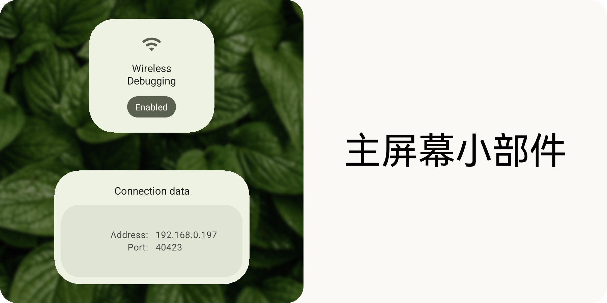
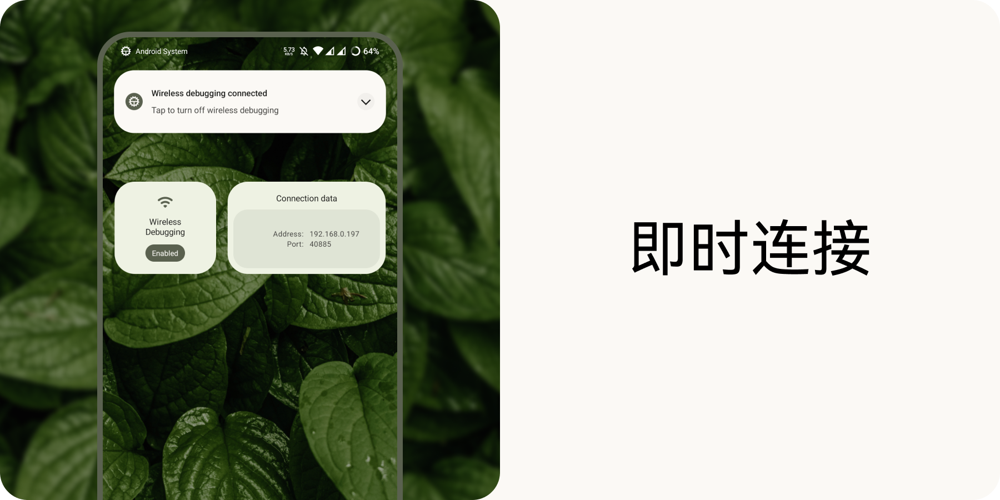
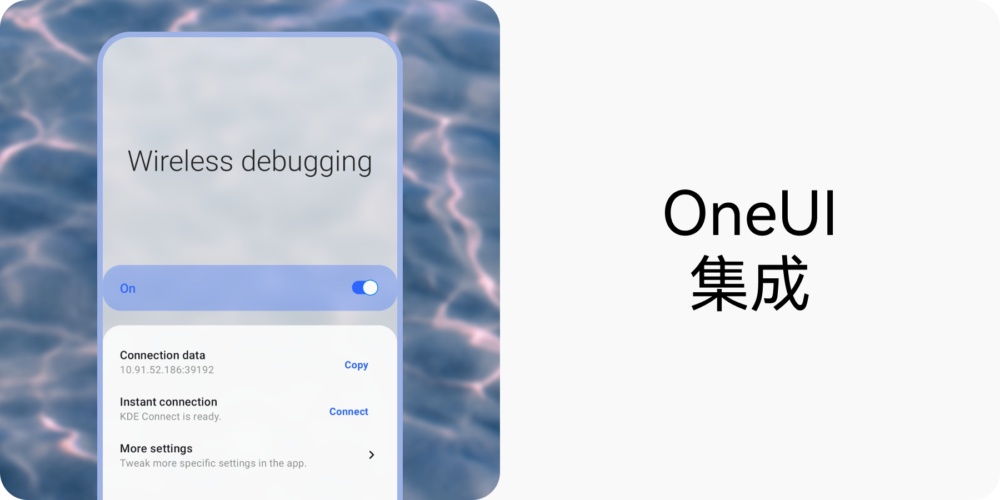

    
    

> 以其他语言阅读：[`🇺🇸`](./readme.md) [`🇷🇺`](./readme.ru.md) [`🇧🇷`](./readme.pt_br.md) [`翻译成您的语言！`](./translate.md)

**WADBS**（**无线安卓调试桥接开关（Wireless Android Debugging Bridge Switch）** 的简称）是一款可以快速开关安卓无线调试功能的应用程序。
它提供了几个小部件和一个快速设置磁贴来实现这一功能。 
您还可以使用 KDE Connect 的剪贴板共享功能（参见 [scripts](./scripts)）即时连接到电脑。

## 特性

## 荣誉

[libsu](https://github.com/topjohnwu/libsu) - 是一个库，它能让要求根的操作更容易执行。
 [Shizuku](https://shizuku.rikka.app/) - 是一个框架， WADBS 可以用来替代 root 访问。
 [IBM Plex Mono](https://fonts.google.com/specimen/IBM+Plex+Mono) - 我在设计此应用程序时使用的字体。
 [HarmonyOS Sans](https://developer.huawei.com/consumer/cn/design/resource-V1/) - 我在设计此应用程序的中文翻译时使用的字体。
 [Leaves](https://unsplash.com/photos/wAU3MfsGPNw) - 一张由 [Aedrian](https://unsplash.com/@aedrian) 制作的令人惊叹的树叶照片，我用它作为我设计的背景。
 [Waves](https://unsplash.com/photos/a-close-up-of-a-body-of-water-with-ripples-dujWQFlKE7c) - 一张由 [Michał Bińkiewicz](https://unsplash.com/@binkievitz) 制作的令人惊叹的波浪照片，我将其用作 OneUI 整合的宣传图片。

## 许可

WADBS 是一款自由软件。制作该软件的初衷是为了让开发者的工作更轻松。
它采用 GNU 通用公共许可证第 3 版。 
简而言之，您可以重新发布和修改它，但应注明原作者。

WADBS 按“原样”发布。 
本应用的开发者不对本仓库的内容或与其直接或间接相关的材料造成的任何损害或伤害负责。
